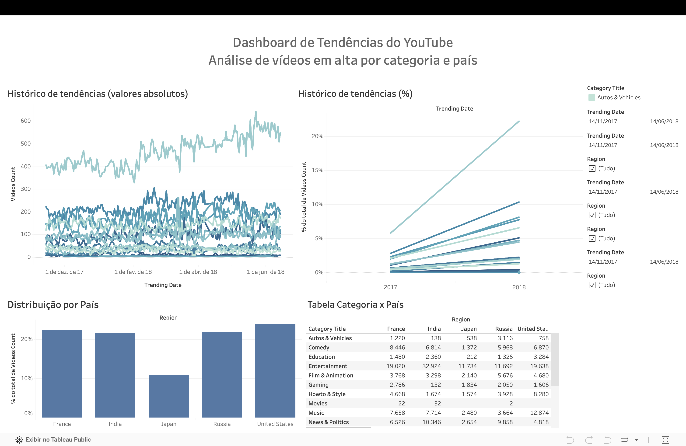

# 📊 YouTube Trends Dashboard

### Interactive Dashboard developed with Tableau Public

**Análise de vídeos em tendência por categoria, país e período**

---

---

# 📌 Sobre o Projeto

Este projeto apresenta um dashboard interativo desenvolvido no Tableau Public para analisar tendências de vídeos do YouTube.

A análise permite identificar padrões de comportamento por categoria, país e período, oferecendo uma visão clara sobre a evolução dos vídeos em tendência.

---

# 🎯 Problema de Negócio

Empresas que investem em publicidade digital precisam compreender quais categorias apresentam maior relevância ao longo do tempo e como esse comportamento varia entre diferentes mercados.

Este dashboard foi desenvolvido para facilitar essa análise por meio de visualizações interativas.

---

# 🛠 Ferramentas Utilizadas

- Tableau Public
- Data Visualization
- Exploratory Data Analysis (EDA)
- Storytelling com Dados
- Git
- GitHub

---

# 📈 Principais Insights

- Entertainment e Music lideram a quantidade de vídeos em tendência.

- Os Estados Unidos apresentam a maior participação entre os países analisados.

- News & Politics e Sports possuem maior relevância no mercado americano.

- O comportamento das tendências varia entre diferentes regiões.

---

# 📂 Arquivos do Projeto

📄 Apresentação_Projeto_Dashboard_de_Tendências_do_YouTube.pdf

🖼 dashboard.png

---

# 🌐 Dashboard Interativo

## Tableau Public

https://public.tableau.com/app/profile/laura.kim.furtado/viz/Projetodetendencias_docx/Painel1

---

# 🚀 Como visualizar

1. Abra o Dashboard no Tableau Public.

2. Utilize os filtros disponíveis.

3. Explore as categorias.

4. Compare países.

5. Analise a evolução temporal.

---

# 👩‍💻 Sobre mim

**Laura Kim Furtado**

Analista de Dados em formação, com experiência em projetos utilizando Python, SQL, Tableau e Power BI para transformar dados em informações úteis para a tomada de decisão.

### LinkedIn

https://linkedin.com/in/laurakimfurtado

### GitHub

https://github.com/LauraaKim
